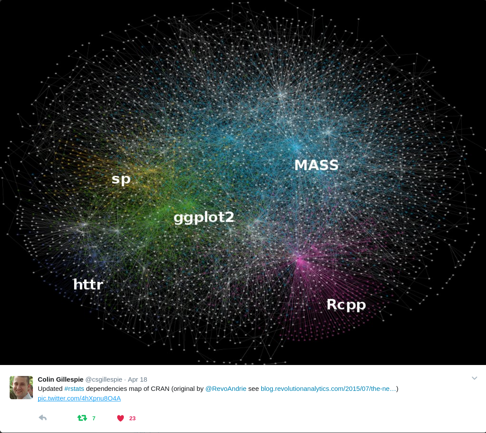
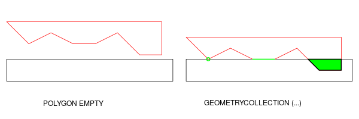

```{r setup, include=FALSE}
knitr::opts_chunk$set(echo = FALSE, collapse = TRUE)
```

-----

 NYT, 2018/1/9
 xkcd.com

## Overview

- Spatial data in R
- Simple features, the `sf` R package
- Geometrical operations
- Tidy: `sf`, `dplyr` & `ggplot2`
- Raster, arrays, spatial data cubes

## Some personal context, I

- studied physical geography, PhD in spatial statistics
- now teach Geoinformatics in Muenster, Germany
- wrote lots of C code in the 90's
- wrote R packages in the 00/10's: gstat, sp, spacetime, trajectories, ...


- recently developed an interest in working with measurement `units` (in R)

-----



## What makes spatial data challenging? 

> - The Earth is a sphere/spheroid/potato*
> - coordinates consist of two or three numbers that _loose most of their meaning when considered individually_
> - the most common form is Longitude, Latitude (LL) pairs
> - from LL data, `stats::dist` will not give you distances
> - maps and screens are flat, and hence can only show _projected_ data
> - projected distances are distorted, and possibly areas, shapes, directions and shortest paths too
> - the meaning of a LL coordinate depends on the geographic _datum_ (e.g., WGS84, ETRS89, NAD27 etc)
> - a _datum_ is unlikely important when mapping continents, but it is when drones try to deliver pizza's

## Simple features

- **feature**: abstraction of real world phenomena (type or instance); has a geometry and other attributes (properties)
- **simple feature**: feature with all geometric attributes described piecewise by straight line or planar interpolation between sets of points (no curves)

- represent geometry by _points_, _lines_ or _polygons_, or _collections_ thereof
- a formal standard (ISO, OGC) since 2004
- supported by OSGeo libraries GEOS and GDAL
- adopted by GeoJSON, GeoSPARQL
- has well-known text (WKT) and binary (WKB) encodings
- WKB used by spatial databases (PostGIS, MariaDB, SQLite, ...)
- standard specifies a number of topological metrics, predicates and operations

## Operations on geometries:

Single:

- logical predicates:  `is_valid`, `is_simple`, `is_empty`
- quantities: `length`, `area`
- `dimension`: 0 = point(s), 1 = linear, 2 = surface
- derived  geometries: `buffer`, `centroid`, `boundary`, `convex_hull`, `simplify`, `linemerge`, `polygonize`, `node`, `point_on_surface`, `triangulate`

Pairs/sets:

- quantities: `distance`
- predicates:  `intersects`, `within`, `contains`, `covers`, `covered_by`, `crosses`, `touches`, `overlaps`, `equals`, `disjoint`, all other DE-9IM 
- new geometries: `intersection`, `difference`, `union`, `sym_difference`

## Intersection special cases



- (typed) `EMPTY`: think of as missing (`NA`) geometry
- `GEOMETRYCOLLECTION`: _single_ feature geometry with mix of anything

## Package `sf`

> - `sf` stores simple feature geometries **as a list-column** 

> - It does that in `sf` objects, _extending_ `data.frame` **or** `tibble`

> - How does it work?

-------------------


-------------------


-------------------


-------------------


## `sfg` : geometry for one feature


--------
```{r sfc, eval = TRUE, echo = TRUE}
library(sf)
```


## Package `sf` features

- `sf` objects extend `data.frame` or `tbl_df` with a geometry list-column
- fast (C++) WKB $\Longleftrightarrow$ R conversion, used for I/O with libraries and databases
- spatial indexes created on-the-fly to scale up geometrical predicates (intersects) and operations (intersection)
- simple and small API
- functions/methods start with `st_`, as in 
```{r example,echo=TRUE}
st_is_simple(st_point(0:1))
```

## `sf` & `tidyverse`

- `sf` spatial objects are `data.frame`s (or `tibble`s)
- you can always un-`sf`, and work with `tbl_df` or `data.frame` having an `sfc` list-column
- `sf` methods for `filter`, `arrange`, `distinct`, `group_by`, `ungroup`, `mutate`, `select` have sticky geometry 
- `st_join` joins tables based on a spatial predicate
-  `summarise` unions geometry by group (or altogether)


```

-------
```{r tidy1, echo = TRUE}
suppressPackageStartupMessages(library(dplyr))
gpkg = system.file("gpkg/nc.gpkg", package="sf")
options(pillar.sigfig = 3)
read_sf(gpkg) %>% select(1:3, 12)
```

-------
```{r tidy2, echo = TRUE}
read_sf(gpkg) %>% select(1:5,12) %>% st_transform(2264) # NC state plane, us foot
```

## `geom_sf`

```{r tidy3, echo = TRUE, fig.height=3}
library(ggplot2) # install_github("tidyverse/ggplot2")
nc <- read_sf(gpkg) %>% st_transform(2264)
ggplot() + geom_sf(data = nc) + aes(fill = BIR74) +
  theme(panel.grid.major = element_line(color = "white")) +
  scale_fill_gradientn(colors = sf.colors(20))
```

-------
```{r tidy4, echo = TRUE}
library(tidyr)
nc2 <- nc %>% select(SID74, SID79) %>% gather(VAR, SID, -geom)
ggplot() + geom_sf(data = nc2, aes(fill = SID)) + facet_wrap(~VAR, ncol = 1) +
  scale_y_continuous(breaks = 34:36) +
  scale_fill_gradientn(colors = sf.colors(20)) +
  theme(panel.grid.major = element_line(color = "white"))
```

-------
```{r mapview, echo = TRUE}
suppressPackageStartupMessages(library(mapview))
nc %>% mapview(zcol = "BIR74", legend = TRUE, col.regions = sf.colors)
```

## quantities

```{r, eval=TRUE, echo = TRUE}
library(sf)
suppressPackageStartupMessages(library(units))

pts = rbind(c(0,80), c(120,80), c(240,80), c(0,80))
pol = st_sfc(st_polygon(list(pts)), crs = "+proj=longlat")

pol %>% st_area %>% set_units(km^2)

# Equidistant Cylindrical (Plate Carrée):
pol %>% st_transform("+proj=eqc") %>% st_area

pol %>% st_set_crs(NA) %>% st_area

pts =  st_sfc(st_point(c(0,90)), st_point(c(0,70)), st_point(c(60,70)), 
              crs = "+proj=longlat")
st_distance(pol, pts) %>% set_units(km)
```

## What about raster data?

- package `raster` is powerful, and works well with pipes
- simple features don't scale for raster / imagery data
- (long) time series on features do neither

Package `github.com/r-spatial/stars` for:

- raster and vector data cubes (arrays)
- take on raster limitations, e.g. 4D+ rasters (band, time)
- take on data sets larger than local disk
- R Consortium project planned to finish 2018 Q2

-------

```{r,eval=TRUE,echo=TRUE,fig.width=5,fig.height=3.5}
suppressPackageStartupMessages(library(stars))
# http://github.com/r-spatial/stars: not yet on CRAN
tif = system.file("tif/L7_ETMs.tif", package = "stars")
plot(st_stars(tif), main = paste("Band", 1:6), col = grey(1:9/10))
```

## Conclusions

- `sf` provides tidy spatial analysis, for vector data
- there are 6 package vignettes for further reading

Work in progress:

> - tidy raster data and space/time array data

Thanks to:

> - the `#rspatial` community
> - R Consortium for funding sf and stars

Join the BoF meeting: Today, 5:30-6:30, Pier room, 3rd floor

<!--
```{r w, echo = FALSE, fig.width = 5, fig.height = 2.5}
library(sf)
data(wrld_simpl, package = "maptools")
w = st_as_sf(wrld_simpl)
plot(w[1])
```
## `sfc` and `sf` objects

How do we maintain feature sets, i.e. collections of records with geometries and other properties?

- `sfg` objects hold a single feature's geometry
- `sfc` objects are list-columns with `sfg` geometries; they have attributes `bbox`, `crs` and `precision` 
- `sf` are `data.frame` or `tbl_df` with a `sfc` list-column; they have attributes `sf_column` and `agr`

-->
